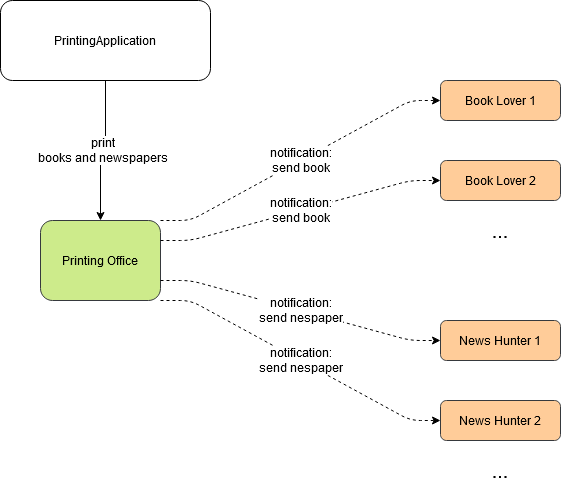

# Books and News

## Exercise 1 - Subscribe to events

### Overview

Let us imagine a Printing Office that periodically prints books and newspapers. In this imagined universe there are some people that want to read those books and some other people that want to read news.

The "Books and News" application is a console application that instantiates a `PrintingOffice` and a few consumers: `BookLover` and `NewsHunter` instances. (See the `PrintingApplication` class.)

When the application is run, it makes a request to the `PrintingOffice` to print some books and some newspapers. Each time a book is printed, all the `BookLover` instances must be notified. Each time a newspaper is printed, all the `NewsHunter` instances must be notified.

### Requirement

Your job is to implement the `PrintingOffice`, the `BookLover` and the `NewsHunter` classes.

> **Note:**
>
> - Implement the solution using events that conform to .NET Guidelines
>   - https://docs.microsoft.com/en-us/dotnet/csharp/programming-guide/events/how-to-publish-events-that-conform-to-net-framework-guidelines

### Block Diagram



 

### Hints

`PrintingOffice` class:

- Should offer a mechanism for the `BookLover` and the `NewsHunter` to subscribe for the corresponding events.

- The `PrintRandom` method should simulate the printing of books and newspapers. We consider "printing" the action of creating a `Book` or a `Newspaper` instance. To create these instances, use the `IBookRepository` and `INewspaperRepository` received on the constructor. After a book or newspaper is "printed" (created), notify the corresponding subscribers.

`BookLover` and `NewsHunter` classes:

- Should subscribe to the corresponding event of the `PrintingOffice` instance that is received on the constructor.

- Whenever a notification is received, should write a message in the log.

## Exercise 2 - Use delegates

Some developers consider that it is overengineering to create events that conform to the .NET Guidelines. Maybe it is, maybe it is not.

However, C# allow us to provide custom format for the event handler function. Modify the previous implementation of the "Books and News" so that the subscribers (`BookLover` and `NewsHunter`) to receive in the event handler only one parameter:

- The `BookLover` should receive a `Book` instance.
- The `NewsHunter` should receive a `Newspaper instance.

```csharp
public class BookLover
{
	...
        
	private void HandleBookPrinted(Book book)
	{
	}
}

public class NewsHunter
{
	...

	private void HandleNewspaperPrinted(Newspaper newspaper)
	{
	}
}
```

### Hints

To provide a custom signature for an event, a custom delegate must be created.